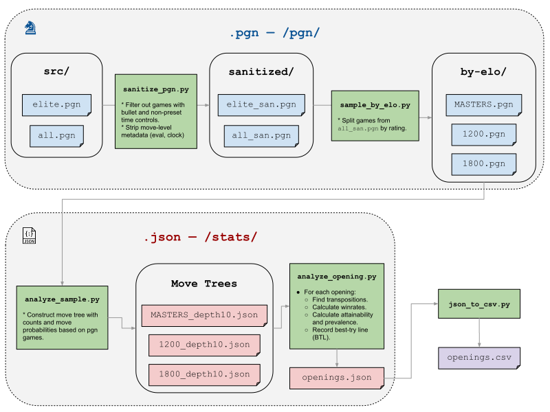
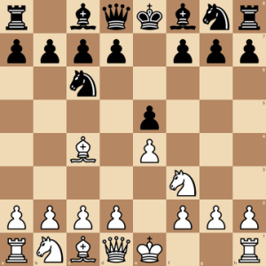
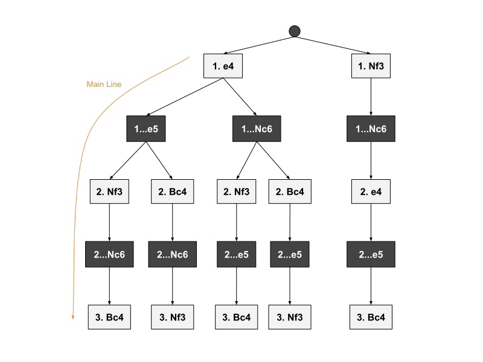
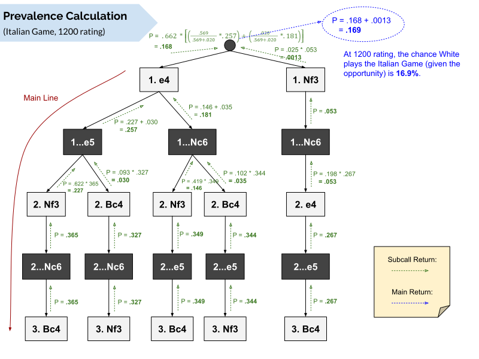

# chess-opening-catalog
Data pipeline for my chess opening catalog.

As originally shared on Reddit: https://www.reddit.com/r/chess/comments/pwsqyv/i_made_a_huge_catalog_of_chess_openings_for/

- **👉 [Main Catalog 📚](https://drive.google.com/file/d/1eNE-3lSm8hMYQZNONbGdcaHMxGxUNhp8/view)**
- **👉 [Data Spreadsheet 📊](https://docs.google.com/spreadsheets/d/1cZ5eNTSTn216PWUG1GZs8nVrtXUV1a02HN7WgDN3mbY/edit?usp=sharing)**

## Data Sources
All opening statistics were collected from PGN files, which were in turn collected from games played on Lichess.
- 1200 and 1800-level games: **[Lichess Open Database](https://database.lichess.org/)**, Jun. 2019
  - 1200-level: 2,110,247 games
  - 1800-level: 2,515,750 games
- Master-level games: **[Lichess Elite Database](https://database.nikonoel.fr/)**, Jun. 2021
  - 780,718 games

I filtered games to exclude:
- Bullet games
- Games played at non-preset (custom) time controls
- Games with unknown result (asterisk-terminated)

### Data Pipeline


## Noteworthy Files
- The source PGN files that I used were extremely bulky and infeasible to upload. Instead, `/pgn/src/` contains samples of 1000 games pre-filtered by rating (1200, 1800, master-level).

- `/stats/MASTERS_depth6.json` contains move-order stats from master-level games at depth 6 (six moves deep, or "6-ply"). I'd recommend opening this with a designated JSON viewer (I personally used [Dadroit Viewer](https://dadroit.com/)).
  - `tot`: Total games played
  - `w_t`: Num. games that White wins
  - `b_t`: Num. games that Black wins
  - `d_t`: Num. games that end in draw
  - `w_p`: Probability that White wins
  - `b_p`: Probability that Black wins
  - `d_p`: Probability that game ends in draw
  - `p`: Probability of move being played
    - Conditional on previous (parent) move


- `/openings.json` contains comprehensive data for a superset of the openings used in the catalog.
  - `main`: Main line of the opening
  - `transpositions`: List of all plausible move-order transpositions
  - `stats_main`: Stats pertaining to main line only (no transpositions)
  - `stats`: Stats pertaining to main line and all transpositions
  - `w_p`, `b_p`, `d_p`, and `tot`: Same as above
  - `prev`: Statistical prevalence of the opening
  - `i_prev`: Inverse prevalence (1 / `prev`)
  - `att`: Statistical attainability of the opening
  - `i_att`: Inverse attainability (1 / `att`)
  - `BTL` (only in `stats`): "Best-try line" to attain the opening
    - Answers the question of "what move(s) should I play to maximize the chance my opponent lets me enter the opening?"


- `/stats/openings.csv` and `/stats/winrates.csv` contain the source CSV data, which I directly uploaded to the Google spreadsheet.

## Prevalence and Attainability
During my data analysis, I defined two statistics for each opening:
- **Prevalence**: How often do players voluntarily enter this opening, when given the opportunity?
  - Measures popularity.
- **Attainability**: How often are players given the opportunity to enter this opening?
  - Measures practicality (i.e. will you actually get chances to play this?).

Let's use the Italian Game as an example, a common opening for White whose **main line (ML)** goes: `1.e4 e5 2.Nf3 Nc6 3.Bc4`



### Single-Line Calculation

The core of these calculations is the chain rule of probability, which decomposes a joint probability into the product of conditional probabilities: `P(A,B,C,…) = P(A) * P(B|A) * P(C|A,B) * …`

In the context of chess, the absolute probability of the Italian Game (ML) being played is:
```
P(Italian) = P(1.e4 e5 2.Nf3 Nc6 3.Bc4)
 = P(1.e4, 1..e5, 2.Nf3, 2..Nc6, 3.Bc4)
 = P(1.e4) * P(1..e5 | 1.e4) * P(2.Nf3 | 1.e4 e5) * …
```

I collected these conditional probabilities during data processing, and stored them in the `p` property of the JSON stats objects (see explanation of `/stats/MASTERS_depth6.json` above).

**Prevalence**

The absolute probability above is not very useful for our purposes, however. In the Italian Game, prevalence should measure _only_ the probability White enters the Italian, so it should be assumed that Black replies with the necessary moves with probability 1:
```
Prev(Italian) = P(1.e4, 2.Nf3, 3.Bc4)
 = P(1.e4) * P(2.Nf3 | 1.e4 e5) * P(3.Bc4 | 1.e4 e5 2.Nf3 Nc6)

Filling in stats collected from 1200-level games:
 = 0.662 * 0.622 * 0.365 ≈ 0.15
```
At 1200-level, White will play the Italian Game (ML) with probability **0.15**, roughly **1 in 7** games.

**Attainability**

Likewise, attainability should measure _only_ the probability Black enables White to play the Italian, so it should be assumed White plays the necessary moves with probability 1:
```
Att(Italian) = P(1..e5, 2..Nc6)
 = P(1..e5 | 1.e4) * P(2..Nc6 | 1.e4 e5 2.Nf3)

Filling in stats collected from 1200-level games:
 = 0.569 * 0.601 ≈ 0.34
```

At 1200-level, Black will allow White to play the Italian Game (ML) with probability **0.34**, roughly **1 in 3** games.

These probabilities are high by most standards, so based on the main line alone, we can conclude that the Italian Game is both a popular and attainable opening at the 1200-level.

### Multiple-Line Calculation (Transpositions)

The first step to incorporate transpositions is to actually enumerate them. I personally did this by generating all permutations of the ML's moves, automatically filtering out illegal lines (such as `1.Bc4 …`), then manually filtering the remaining lines by feasibility (such as `1.Nf3 e5…`, which makes no practical sense for Black).

The resulting transpositions for the Italian Game are as follows:
```
[ "1. e4 e5 2. Bc4 Nc6 3. Nf3",
  "1. e4 Nc6 2. Nf3 e5 3. Bc4",
  "1. e4 Nc6 2. Bc4 e5 3. Nf3",
  "1. Nf3 Nc6 2. e4 e5 3. Bc4" ]
```

It's useful to visualize them as a move tree, together with the main line. Every path from root to leaf is a valid transposition:


This representation lends itself to recursive decision-tree probability calculations, in which we add horizontally and multiply vertically. Based on this tree, we can decompose the absolute probability of the Italian Game being played as follows:
```
P(Italian) = [P(1.e4) * P(Italian | 1.e4)] + [P(1.Nf3) * P(Italian | 1.Nf3)]
                            |
    v-----------------------+
P(Italian | 1.e4) = [P(1..e5 | 1.e4) * P(Italian | 1.e4 e5)] + [P(1..Nc6 | 1.e4) * P(Italian | 1.e4 e5)]
                                           |
    v--------------------------------------+
P(Italian | 1.e4 e5) = [P(2.Nf3 | 1.e4 e5) * P(Italian|…2.Nf3)] + [P(2.Bc4 | 1.e4 e5) * P(Italian|…2.Bc4)]

and so on...
```

**Prevalence**

Similar to the single-line case, we want prevalence to solely measure how willing White is to play the Italian. Therefore, we modify the absolute probability to limit the sample space of Black's replies, so only the moves that coincide with an Italian transposition remain. We are essentially normalizing the probability of Black's moves.
- If Black only has one option (e.g. `1..Nc6` after `1.Nf3`), this reduces to the single-line case: Black plays their move with probability 1.
- If Black has more than one option (e.g. either `1..e5` or `1..Nc6` after `1.e4`), we normalize the move probabilities so that they sum to 1.
  - In 1200-level games, after `1.e4`, Black replies `1..e5` with probability 0.569, and `1..Nc6` with probability 0.020. After normalization, 0.569 becomes `0.569 / (0.569 + 0.020)` = **0.966** whereas 0.020 becomes `0.020 / (0.569 + 0.020)` = **0.034**.

The full calculation is visualized below:



**Attainability**

The calculation gets pretty interesting here. Attainability should solely measure how likely Black allows White to enter the Italian, but assuming White is statistically informed, White can steer the position into those that maximize the chance Black will play into the Italian. This allows us to make stronger assumptions about White's play.

If White has a choice between several moves, they should only choose a single move: the move that maximizes the attainability. These choices are recorded in the **best-try line**, or **BTL**, since it is the best try White has to enter the opening. With this knowledge, we can effectively discard transpositions that yield inferior probabilities.
- At 1200-level, after the moves `1.e4 e5`, White can follow with either `2.Nf3` or `2.Bc4` to enter the Italian. Which move should White play? After `2.Nf3`, the chance Black plays the necessary `2..Nc6` is 0.601, whereas after `2.Bc4`, Black only plays this critical move with probability 0.245. Clearly, White's best try is `2.Nf3` (which happens to be the main line), so White should play it with probability 1.


Experienced chess players will expect the prevalence of the Italian Game to drop at higher ratings, as the Italian becomes supplanted by openings that give Black a harder task at equalizing (such as the Ruy Lopez: `3.Bb5` instead of `3.Bc4`). They will also expect the attainability to drop, as Black opts for more ambitious defenses that immediately unbalance the position (most notably the Sicilian Defense: `1..c5`). Indeed, both of these trends are actually the case! The prevalence of the Italian is roughly the same at the 1800-level but drops to 0.111 at the master-level; the attainability drops to 0.223 at the 1800-level and 0.151 at the master-level.

## Known Issues
- [ ] Debugging statements are messy. Use an actual logger instead.
- [ ] Many execution parameters are scattered and de-centralized. Either move to config file or create a driver script to orchestrate the pipeline.
- [x] **[Resolved]** Original prevalence calculation was conceptually flawed, allowing for probabilities greater than 1 under extreme but possible circumstances.
- [ ] Prevalence and attainability for system-based openings (e.g. London System) are likely underestimates, since there are many alternative lines in addition to the main line and its transpositions.
- [ ] Stats do not account for _future_ transpositions into the variation of an opening. For example, after `1.Nf3 c5` White will sometimes transpose into an Open Sicilian with `2.e4`, never having entered the starting position of the Sicilian itself.
