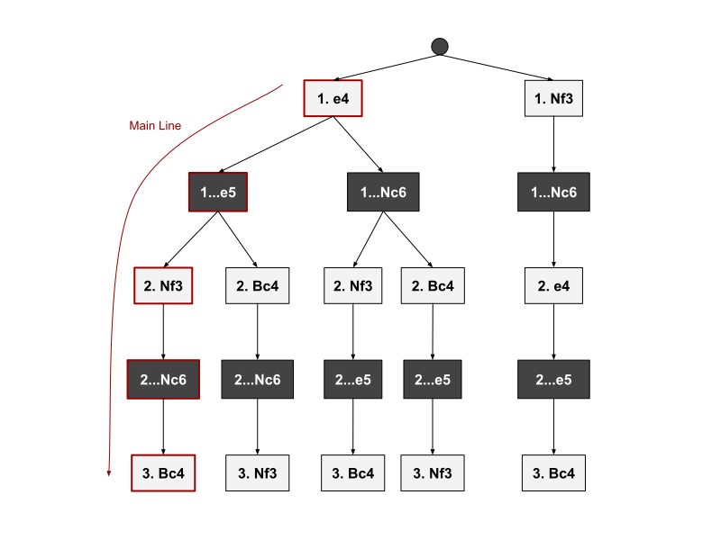
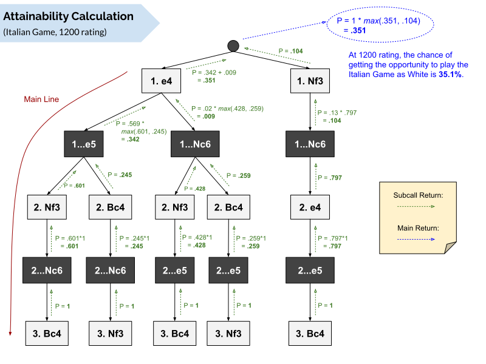

# chess-opening-catalog
Data pipeline for my chess opening catalog.
- 📚 *[Main Catalog](https://drive.google.com/file/d/1eNE-3lSm8hMYQZNONbGdcaHMxGxUNhp8/view)*
- 📊 *[Data Spreadsheet](https://docs.google.com/spreadsheets/d/1cZ5eNTSTn216PWUG1GZs8nVrtXUV1a02HN7WgDN3mbY/edit?usp=sharing)*

## Data Sources
All opening statistics were collected from PGN files, which were in turn collected from games played on Lichess.
- 1200 and 1800-level games: **[Lichess Open Database](https://database.lichess.org/)**, Jun. 2019
  - 1200-level: 2,110,247 games
  - 1800-level: 2,515,750 games
- Master-level games: **[Lichess Elite Database](https://database.nikonoel.fr/)**, Jun. 2021
  - 780,718 games

I filtered games to exclude:
- Bullet games
- Games played at non-preset (custom) time controls
- Games with unknown result (asterisk-terminated)

### Data Pipeline


## Noteworthy Files
- The source PGN files that I actually used were extremely bulky and infeasible to upload. Instead, `/pgn/src/` contains samples of 1000 games pre-filtered by rating (1200, 1800, master-level).

- `/stats/MASTERS_depth6.json` contains move-order stats from master-level games at depth 6 (six moves deep, or "6-ply"). I'd recommend opening this with a designated JSON viewer. I personally used [Dadroit Viewer](https://dadroit.com/).
  - `tot`: Total games played
  - `w_t`: Num. games that White wins
  - `b_t`: Num. games that Black wins
  - `d_t`: Num. games that end in draw
  - `w_p`: Probability that White wins
  - `b_p`: Probability that Black wins
  - `d_p`: Probability that game ends in draw
  - `p`: Probability of move being played
    - Conditional on previous (parent) move


- `/openings.json` contains data for a superset of the openings used in the catalog.
  - `main`: Main line of the opening
  - `transpositions`: List of all plausible move-order transpositions
  - `stats_main`: Stats pertaining to main line only (no transpositions)
  - `stats`: Stats pertaining to main line and all transpositions
  - `w_p`, `b_p`, `d_p`, and `tot`: Same as above
  - `prev`: Statistical prevalence of the opening
  - `i_prev`: Inverse prevalence (1 / `prev`)
  - `att`: Statistical attainability of the opening
  - `i_att`: Inverse attainability (1 / `att`)
  - `BTL` (only in `stats`): "Best-try line" to attain the opening
    - Answers the question of "what move(s) should I play to maximize the chance my opponent lets me enter the opening?"


- `/stats/openings.csv` and `/stats/winrates.csv` contain the source CSV data, which I directly uploaded to the Google spreadsheet.

## Prevalence and Attainability
During my data analysis, I defined two statistics for each opening:
- **Prevalence**: How often do players voluntarily enter this opening, when given the opportunity?
  - Measures popularity.
- **Attainability**: How often are players given the opportunity to enter this opening?
  - Measures practicality (i.e. will you actually get chances to play this?).

Let's use the Italian Game as an example, a common opening for White whose **main line (ML)** goes: `1.e4 e5 2.Nf3 Nc6 3.Bc4`


### Single-Line Calculation

The core of these calculations is the chain rule of probability, which decomposes a joint probability into the product of conditional probabilities: `P(A,B,C,…) = P(A) * P(B|A) * P(C|A,B) * …`

In the context of chess, the absolute probability of the Italian Game (ML) being played is:
- `P(1.e4 e5 2.Nf3 Nc6 3.Bc4)`
- `= P(1.e4, 1..e5, 2.Nf3, 2..Nc6, 3.Bc4)`
- `= P(1.e4) * P(1..e5 | 1.e4) * P(2.Nf3 | 1.e4 e5) * …`

I collected these conditional probabilities during data processing, and stored them in the `p` property of the JSON stats objects (see explanation of `/stats/MASTERS_depth6.json` above).

However, this absolute probability is not very useful for our purposes. In the Italian Game, prevalence should measure _only_ the probability White enters the Italian, so it should be assumed that Black replies with the necessary moves with probability 1. Therefore, the prevalence is:
  - `= P(1.e4, 2.Nf3, 3.Bc4)`
  - `= P(1.e4) * P(2.Nf3 | 1.e4 e5) * P(3.Bc4 | 1.e4 e5 2.Nf3 Nc6)`
  - Filling in stats collected from 1200-level games:
    - `= 0.662 * 0.622 * 0.365 ≈ 0.15`
    - At 1200-level, White will play the Italian Game (ML) with probability **0.15**, roughly **1 in 7** games.

Likewise, attainability should measure _only_ the probability Black enables White to play the Italian, so it should be assumed White plays the necessary moves with probability 1. The attainability is:
  - `= P(1..e5, 2..Nc6)`
  - `= P(1..e5 | 1.e4) * P(2..Nc6 | 1.e4 e5 2.Nf3)`
  - Filling in stats collected from 1200-level games:
    - `= 0.569 * 0.601 ≈ 0.34`
    - At 1200-level, Black will allow White to play the Italian Game (ML) with probability **0.34**, roughly **1 in 3** games.

These probabilities are high by most standards, so based on the main line alone, we can conclude that the Italian Game is both a popular and attainable opening at the 1200-level.

### Multiple-Line Calculation (Transpositions)

The first step in incorporating transpositions into the calculation is to enumerate them. I personally did this by generating all permutations of the ML's moves, automatically filtering out illegal lines (such as `1.Bc4 …`), then manually filtering the remaining lines by feasibility (such as `1.Nf3 e5…`, which makes no practical sense for Black).

The resulting transpositions for the Italian Game are as follows:
```
[ "1. e4 e5 2. Bc4 Nc6 3. Nf3",
  "1. e4 Nc6 2. Nf3 e5 3. Bc4",
  "1. e4 Nc6 2. Bc4 e5 3. Nf3",
  "1. Nf3 Nc6 2. e4 e5 3. Bc4" ]
```

It's useful to visualize them as a move tree, together with the main line. Each path from root to leaf is a valid transposition:


Attainbility assumes BTL.




Experienced chess players will expect the prevalence of the Italian Game to drop at higher ratings, as the Italian becomes supplanted by openings that give Black a harder task at equalizing (such as the Ruy Lopez: `3.Bb5` instead of `3.Bc4`). They will also expect the attainability to drop, as Black opts for more ambitious defenses that immediately unbalance the position (most notably the Sicilian Defense: `1..c5`). Indeed, both of these trends are actually the case! The prevalence of the Italian drops to 0.266 at the 1800-level and 0.175 at the master-level. Similarly, the attainability drops to 0.223 at the 1800-level and 0.151 at the master-level.

## Known Issues
- Debugging statements are messy. Use an actual logger instead.
- Many execution parameters are scattered and de-centralized. Either move to config file or create a driver script to orchestrate the pipeline.
- Prevalence and attainability for system-based openings (e.g. London System) are likely underestimates, since there are many alternative lines in addition to the main line and its transpositions.
